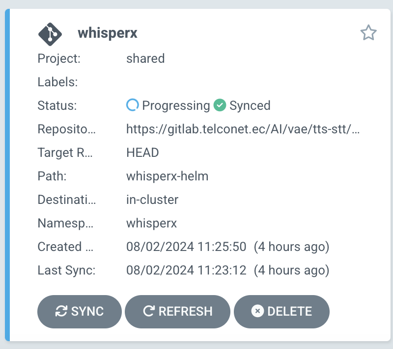
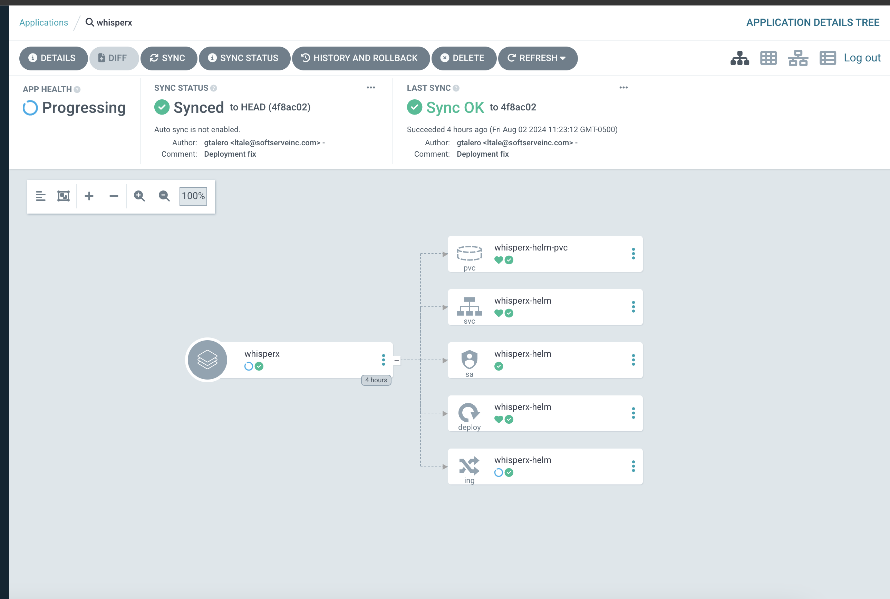
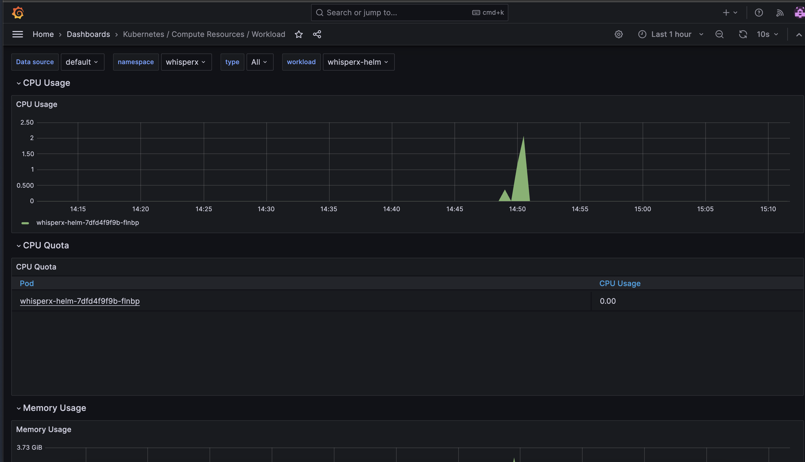
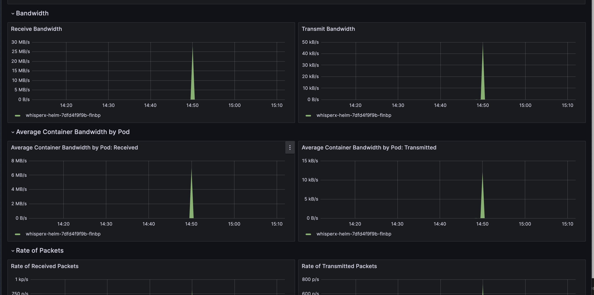

<p align="center">
  <a href="https://github.com/m-bain/whisperX/stargazers">
    
  </a>
  <a href="https://github.com/m-bain/whisperX/issues">
        
  </a>
  <a href="https://github.com/m-bain/whisperX/blob/master/LICENSE">
        
  </a>
  <a href="https://arxiv.org/abs/2303.00747">
        
  </a> 
</p>

# WhisperX Documentation for DevOps

WhisperX is an advanced automatic speech recognition (ASR) solution designed to provide fast, accurate, and scalable speech-to-text services. Hosted at "https://gitlab.telconet.ec/AI/vae/tts-stt/whisperx-helm-chart", this documentation serves as a comprehensive guide for DevOps professionals looking to deploy WhisperX within Kubernetes environments using Helm charts. WhisperX leverages NVIDIA Riva's capabilities to enhance performance in real-time speech AI applications, including speech recognition and natural language understanding.

## Specific Objective: Implementing WhisperX for Advanced Speech Recognition Services at Telconet

The primary objective of deploying WhisperX within Telconet's technological infrastructure is to utilize advanced automatic speech recognition (ASR) capabilities to bolster communication and operational efficiency across various applications. WhisperX stands out for its fast transcription speeds, precise word-level timestamping, and robust speaker diarization, making it an ideal solution for enhancing interactive voice-responsive systems.

This documentation aims to assist Telconet’s development teams through the detailed processes of setting up, integrating, and deploying WhisperX, ensuring that they can fully harness its features to improve the quality and accessibility of Telconet’s services. The focus is not just on technical deployment but also on optimizing WhisperX to meet the specific needs of Telconet’s diverse client base.

### Project Restrictions and Infrastructure

In the specific setup for WhisperX, Telconet utilizes one GPU from the DGX A100 system. This allocation is tailored to optimize the performance of WhisperX, ensuring that it can handle the real-time speech recognition tasks efficiently. The use of a single GPU is configured to balance resource usage and performance needs, providing a sustainable model for continuous operation.

The Kubernetes deployment of WhisperX makes use of pod selectors to efficiently manage the resources within the Telconet's Kubernetes cluster. This configuration ensures that WhisperX runs on the appropriate hardware, specifically targeting pods that operate on the DGX A100 system. By doing so, Telconet maintains a high level of performance and reliability for the WhisperX service, making full use of the dedicated GPU resources.

### Role of WhisperX in the Project

WhisperX extends beyond basic transcription by offering word-level timestamps and speaker diarization. This functionality enables the project to dissect complex audio streams into discernible, speaker-specific segments, and precisely timestamped words. Such detailed analysis is invaluable in scenarios where understanding the context, timing, and speaker identity plays a critical role, such as in meeting transcriptions or multi-party negotiations.

The real-time processing capabilities of WhisperX empower the project to support decision-making processes that rely on immediate speech recognition and analysis. Whether it's providing instant responses in customer service interactions or generating real-time subtitles for live broadcasts, WhisperX enhances the responsiveness and accessibility of services.

### Key Benefits of Using WhisperX

- **Enhanced Real-Time Transcription Speeds**: WhisperX stands out for its ability to deliver transcriptions significantly faster than real-time. Utilizing the large-v2 model, it can perform batched inference at up to 70x real-time speeds, making it one of the fastest ASR technologies available. This rapid processing capability is crucial for applications that require immediate transcription, such as live event broadcasting and urgent communication needs.

- **Accurate Word-Level Timestamps**: Unlike many ASR systems that only provide segment-level timing, WhisperX offers precise word-level timestamps. This feature is invaluable for detailed analysis and applications such as closed captioning and detailed media analysis, where exact timing can greatly enhance the utility and accessibility of transcribed content.

- **Speaker Diarization Capabilities**: WhisperX incorporates advanced speaker diarization, which enables it to distinguish between different speakers in an audio stream. This functionality is essential for applications like meeting transcription or legal proceedings where identifying the speaker is as critical as what is being said.

- **Efficient Handling of Diverse Accents and Languages**: Built on OpenAI’s Whisper model, WhisperX has been trained on a diverse dataset, enabling it to recognize a wide range of accents and languages with high accuracy. This makes it highly adaptable and effective in global applications, where users may interact with the system using various dialects and linguistic nuances.

- **Scalability**: The system is designed to scale seamlessly, accommodating anything from small, personal projects to large-scale enterprise deployments. This scalability ensures that as user demands increase, WhisperX can handle growing volumes of data without a loss in performance quality.

- **Integration and Customization**: WhisperX offers flexible integration options, making it compatible with a variety of existing systems and platforms. Developers can customize and extend its capabilities to suit specific needs, further enhancing its applicability across different sectors and use cases.

## Table of Contents
<style scoped>
</style>

| Syntax                                                                                             | Description                                                     |
| :------------------------------------------------------------------------------------------------- |:----------------------------------------------------------------|
| [Prerequisites](#prerequisites)                                                                    | What is needed to use WhisperX in a Kubernetes environment      |
| [Installation](#installation)                                                                      | Methods for installing WhisperX, both manually and using ArgoCD |
| [Use](#use)                                                                                        | How to use WhisperX after 0.                                    |                                 |
| [Monitoring and Logging](#monitoring-and-logging)                                                  | Setting up monitoring and logging for Riva                      |

<div style="page-break-after: always"></div>

## Prerequisites

Before proceeding, WhisperX's deployment in this documentation is tailored for the following version and dependencies:

- **Python Version**: Python 3.10 is required for WhisperX. It's specifically tested and supported for this version to ensure reliability and stability. Python 3.10 should be installed and used within a virtual environment to manage dependencies efficiently.

- **PyTorch**: WhisperX requires PyTorch version 2.0.0. This version is crucial for ensuring compatibility with the WhisperX functionalities, particularly those that involve neural network operations. Install PyTorch with CUDA 11.8 support to leverage GPU acceleration for computational tasks. PyTorch Installation Guide.

- **CUDA and cuDNN**: For GPU execution, ensure that NVIDIA's CUDA 11.8 and cuDNN 8.x are installed. These libraries provide the necessary GPU acceleration for PyTorch, enhancing performance for training and inference tasks involving large datasets. Refer to NVIDIA's CUDA Toolkit and cuDNN for installation instructions.

- **Conda Environment**: It is recommended to use Conda for managing the Python environment. This helps in maintaining the project dependencies isolated from the global Python environment, thus avoiding version conflicts. Create and activate a new Conda environment specifically for WhisperX to manage dependencies effectively.
 
- **Dockerfile**: The dockerfile containing the WhisperX repository files, along with access from FastAPI

## Installation

Deploying WhisperX involves a streamlined process that can be approached either manually or through automation tools like Helm in Kubernetes environments. This setup guide provides comprehensive instructions for installing WhisperX, focusing on leveraging its advanced speech recognition capabilities within your infrastructure.

The manual installation method offers detailed control over each step, from setting up the necessary Python environment to configuring WhisperX with specific dependencies like PyTorch and CUDA. This approach is ideal for users who require specific configurations or need to integrate WhisperX closely with other components in their system.

For environments that support or prefer automated deployments, using Helm charts facilitates the rapid provisioning and management of WhisperX within Kubernetes clusters. This method simplifies the deployment process, reduces the potential for human error, and ensures consistency across different deployment stages or environments.

### Dockerfile preparation

The Dockerfile provided is tailored for deploying WhisperX in a containerized environment using Miniconda as the base image. This setup is structured to ensure a clean and efficient installation of WhisperX and its dependencies within a virtualized container, allowing it to operate independently of the host system's Python environment.

Here’s a breakdown of the Dockerfile setup:

1. Base Image: The Dockerfile starts with continuumio/miniconda3 as the base image, providing a minimal setup with Conda installed, which is essential for managing Python environments and packages.

2. Working Directory: It sets /app as the working directory where all operations are performed inside the container.

3. System Dependencies: Installs essential system packages like ffmpeg for handling multimedia content and git for version control, ensuring that these tools are available for WhisperX operations.

4. Conda Environment: Creates a new Conda environment named whisperx specifically with Python 3.10, isolating the WhisperX dependencies from other Python environments on the container.

5. Python Environment Activation: It adjusts the Docker shell to activate the whisperx environment automatically when running shell commands, ensuring that all Python and command-line operations occur within the context of the created Conda environment.

6. PyTorch and CUDA: Installs PyTorch, torchaudio, and CUDA toolkit from the PyTorch and NVIDIA channels directly within the Conda environment, aligning with the requirements for GPU-accelerated tasks.

7. Python Dependencies: Installs additional Python dependencies listed in the requirements.txt file found in the whisperX directory, ensuring all required libraries are available.

8. WhisperX Installation: Installs WhisperX from the local codebase, making the speech recognition functionalities of WhisperX available within the container.

9. Application Exposure: The container exposes port 9080, setting up the container to listen on this port when serving requests, making it accessible to requests from outside the container.

10. Default Command: The default command starts a Uvicorn server, which serves a FastAPI application defined in app.py located in the /app/whisperX directory, effectively turning the Docker container into a web server ready to handle API requests at startup.

### Manual Installation

#### Installing through Helm chart

To install WhisperX, follow these detailed steps to ensure a successful deployment using Helm:

1. **Create the Helm Chart**

Before you can deploy WhisperX with Helm, you first need to create a Helm chart. This is a collection of files that describe a related set of Kubernetes resources.

   ```sh
   helm create whisperx-helm
   ```
This command creates a new directory called `whisperx-helm` with all the necessary files and directory structure for your Helm chart.

2. **Configure the Helm Chart**

After the chart is created, you need to configure it to suit the WhisperX deployment:

- Edit the `values.yaml` file:

Update the image repository and tag.
Specify any default configurations such as resource limits, service ports, and other deployment specifics.

- Customize the `deployment.yaml`:

Ensure the deployment template correctly points to the Docker image, configures ports, sets up volume mounts, and other necessary specs.

- Configure persistence:

If WhisperX needs to store data persistently, configure the persistent volume claims in the chart.


3. **Package the Helm Chart**

Once your chart is configured, you need to package it into a versioned chart archive file.

   ```sh
   helm package whisperx-helm
   ```
This command creates a versioned chart archive in your working directory that you can deploy to any Kubernetes cluster.

4. **Deploy the Helm Chart**

Now, deploy the packaged Helm chart to your Kubernetes cluster.

   ```sh
   helm install whisperx-release ./whisperx-helm-0.1.0.tgz
   ```
Replace whisperx-release with a name for your release, and adjust the chart archive file name based on the version you packaged.

The logs for to verify the installation are like:
   ```sh
    NAME: whisperx-helm
    LAST DEPLOYED: Wed Jul 31 12:20:47 2024
    NAMESPACE: default
    STATUS: deployed
    REVISION: 1
    NOTES:
    1. Get the application URL by running these commands:
      http://whisperx-helm.local/
   ```
5. **Verify the installation**

In another terminal, run the following command to check the status of your pods:
   ```sh
   kubectl get pods
   ```

You should be able to see a similar output like this:
   ```sh
   NAME                                            READY   STATUS    RESTARTS   AGE
   whisperx-helm-75dd4d8bfc-zmnms               1/1     Running   3 (2m26s ago)   3m30s
   ```

### Deploying WhisperX through ArgoCD

#### Repository Structure

The current structure of the [repository](https://gitlab.telconet.ec/AI/vae/tts-stt/whisperx-helm-chart.git) is as follows:

- **Helm Charts**: Place WhisperX Helm charts in this directory.
- **Templates**: Kubernetes resource definitions and other templates.
- **Values**: Configuration files for different environments (development, staging, production).

#### Connect Repository to ArgoCD

In the ArgoCD dashboard, add your repository as a new application. Specify the path to the WhisperX Helm chart within your repository and configure the deployment settings according to your environment.

#### Deploy and Monitoring Application
Trigger the deployment through ArgoCD by syncing the WhisperX application. ArgoCD will pull the latest changes from your Git repository and start the deployment process based on the defined Helm chart and values.

Monitor the deployment status in the ArgoCD dashboard. Check for any sync issues or errors in the deployment process. Ensure that all Kubernetes resources are correctly created and that the WhisperX application reaches a healthy state.

#### Verify WhisperX Functionality

Once the deployment is successful and the application is stable, verify WhisperX functionality by accessing its services. This may involve interacting with the deployed WhisperX instance via test requests to confirm that it is processing inputs and delivering expected outputs correctly.

In the ArgoCD dashboard, search for the `whisperx` application as shown in the following image:



Verify that the application is correctly synced and has a healthy status. This step is crucial to confirm that the updates have been successfully deployed and that the Riva service is operating without issues. Monitoring the sync status and health in ArgoCD helps maintain the stability and reliability of your WhisperX deployment. An example of the healthy status of the app might look like the following:



## Use

#### Accessing WhisperX from Jupyter Notebook

WhisperX is utilized in two primary Jupyter Notebooks:

- Speech Recognition: This notebook is set up to convert spoken language into written text, effectively showcasing WhisperX's Automatic Speech Recognition (ASR) capabilities. It is designed to handle audio inputs, which are processed by WhisperX to generate accurate transcriptions.

- Batch Processing of Audio Files: Another notebook focuses on batch processing, demonstrating WhisperX's ability to handle multiple audio files simultaneously. This is particularly useful for processing large datasets efficiently.

#### Jupyter Notebook STT

The notebook is designed to demonstrate how users can programmatically interact with the WhisperX service. It simplifies the process of sending audio files and customizing requests with specific parameters like language preference and computation type.

Users can execute the notebook to send HTTP POST requests to the WhisperX service. The request includes an audio file and optional parameters that specify the language and computation type. This setup is ideal for testing and debugging the speech recognition capabilities of WhisperX in a controlled environment.

Here is a basic example of how to use WhisperX in a Jupyter Notebook for sending an audio file to a WhisperX-based FastAPI service for speech recognition:

   ```sh
    with open(file_path, 'rb') as file:
        files = {'file': (file.name, file, 'audio/wav')}
        
        # Make the POST request with parameters
        response = requests.post(url, params=params, files=files)
        
        # Print the response from the server
        print(response.text)
   ```

This code snippet demonstrates a straightforward way to interact with WhisperX through HTTP requests, providing a practical example that can be expanded upon for more complex applications involving speech data.

**Using the notebook**

1. Set Up: The notebook begins by importing necessary Python libraries such as `requests`. This library is crucial for making HTTP requests to the WhisperX service.

2. Specify the Service URL: The URL configured in the notebook points to the WhisperX service deployed within the Kubernetes cluster. This URL is crucial for directing requests to the correct service endpoint.

3. Prepare the Audio File: Users need to specify the path to the audio file they wish to transcribe. This file is opened in binary mode and attached to the POST request.

4. Customization through Parameters: The notebook allows users to specify parameters such as `language` and `compute_type`. These parameters are sent as part of the query string in the POST request, allowing users to tailor the transcription process to their specific needs.

5. Sending the Request: The notebook uses the requests.post method to send the audio file and parameters to the WhisperX service. The response from the service is then printed, showing the transcription results or any error messages.

6. Error Handling: The notebook includes basic error handling that captures and displays errors from the transcription process, aiding in troubleshooting and ensuring that users can identify and resolve issues quickly.

#### Accessing WhisperX from Outside the Cluster (Port Forward)

Port forwarding is a technique used to expose services running on specific ports within a Kubernetes cluster to ports on the user's local machine. This allows the user to send requests to the service using `localhost`, effectively bypassing the need for external exposure of the service.

##### Setting Up Port Forwarding

To set up port forwarding with WhisperX, the following steps can be followed:

- **Identify the Service**: Determine the service within the Kubernetes cluster that you want to access. In this case, it’s the WhisperX service.

- **Open a Terminal**: On your local machine, open a terminal window.

- **Execute the Port Forwarding Command**:

   ```sh
   kubectl port-forward svc/whisperx-helm 9000:80
   ```
- Once port forwarding is set up, you can access WhisperX using your web browser or any HTTP client by navigating to:

   ```sh
   http://localhost:9000/docs
   ```

This URL directs to the WhisperX service through the forwarded port, allowing you to interact with it as though it were running on your local machine.

### Responses

The response from the WhisperX endpoint when processing audio files is detailed and structured, facilitating multiple forms of output to accommodate different use cases. Each output format serves a specific purpose and caters to various needs for analysis and presentation of speech recognition results:

**JSON**

The JSON file contains comprehensive details about the transcription, including segments of recognized speech. Each segment includes the start and end times, the transcribed text, and word-level details such as the start and end times for each word, their transcription, and confidence scores. This format is ideal for developers and researchers who need detailed information for further processing or analysis.

**TSV (Tab-separated values)**

This format provides a simpler, table-like view of the transcriptions. It lists the start and end times alongside the corresponding transcribed text, formatted in a way that is easy to import into spreadsheet software or databases for quick reviews or integration with other data sources.

**TXT**

The TXT file contains the plain transcription text without any timestamps or additional metadata. This format is best suited for users who need the transcription results for content creation, documentation, or further textual analysis without the complexity of timestamps or confidence scores.

**VTT (Web Video Text Tracks)**

The VTT file is designed for use as subtitles or captions in video players. It includes timing information that aligns the transcribed text with the corresponding times in the audio file, making it useful for creating accessible media content or for review purposes where timing alignment with the audio is crucial.

**SRT (SubRip Subtitle)**

Similar to the VTT, the SRT format is another common type of subtitle file that includes sequential numbering of subtitles, the start and end times, and the corresponding text. It is widely used for adding subtitles to videos and is supported by most video playback software.

Each format provides a different level of detail and is suitable for various applications, from detailed analysis to content creation and media production. The choice of format depends on the specific requirements of the task at hand, whether it involves detailed linguistic analysis, simple content transcription, or media captioning.

## Monitoring and Logging

WhisperX includes support for Prometheus metrics, which can be scraped for monitoring. Currently there are a couple of metrics being displayed in
[Grafana](https://aimp-telemetry.ai-dev.i.telconet.net)






